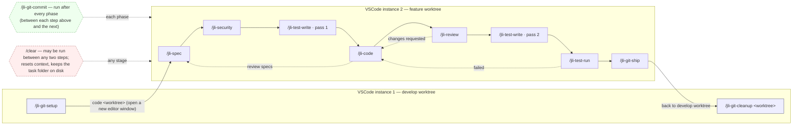

# Agent-to-Command Migration

This document describes how the orchestrator-driven multi-agent pipeline was migrated into a
**manually-chained set of `jli-` slash commands**. The new commands are the supported way to
develop a feature; the old `tackle` / orchestrator flow is deprecated.

## Why

The pipeline was driven by `agent-0-orchestrator`, which spawned every specialist agent via
the Task tool and threaded state through one long-running context. That context overflowed
easily and left the human no natural place to intervene between phases. The manual chain
fixes both: each command is a single, stateless step the human runs by hand, with a `/clear`
allowed between any two steps to keep context small.

## Worktree layout and run location

The repo uses one bare repo with sibling worktrees under a shared parent:

```
<parent>/<repo-name>.git              <- bare repo
<parent>/<repo-name>-develop          <- develop worktree
<parent>/<repo-name>_<type>-<slug>    <- a feature worktree
```

`/jli-git-setup` and `/jli-git-cleanup` run from the **develop worktree**. Every other
command runs from inside the **feature worktree** — you open it in its own editor window
(`code <worktree>`) after setup, and all later commands run in that window.

## How state flows

All state lives in the task folder under the feature worktree:
`docs/prompts/tasks/issue-<id>-<slug>/`. Each command reads the artifacts written by earlier
commands and writes its own. Because the phase/commit/ship commands run *inside* the feature
worktree, the task folder is a simple relative path — you pass it as a `@`-mention
(`@docs/prompts/tasks/issue-<id>-<slug>`), never an absolute path. The argument is required on
every command, so each one rebuilds what it needs from disk after a `/clear`.

The **specification phase is the input exception**: `/jli-spec` reads the `README.md` request
created by `/jli-git-setup` rather than a prior pipeline artifact.

## Command ↔ agent mapping

| Command | Runs from | Replaces (agent) |
|---|---|---|
| `/jli-git-setup <issue-num + title>` | develop | `agent-4-git` Tasks 1–2 (fetch + worktree) |
| `/jli-spec @<task-folder>` | feature worktree | `agent-1-specs` |
| `/jli-security @<task-folder>` | feature worktree | `agent-5-security` |
| `/jli-test-write @<task-folder> [pass]` | feature worktree | `agent-3-test-writer` (pass 1 and 2) |
| `/jli-code @<task-folder>` | feature worktree | `agent-2-coder` |
| `/jli-review @<task-folder>` | feature worktree | `agent-6-reviewer` |
| `/jli-test-run @<task-folder>` | feature worktree | `agent-3-test-runner` |
| `/jli-git-commit @<task-folder>` | feature worktree | `agent-4-git` commit tasks (3 / 3.5 / 3.7 / 4 / 5-commit) |
| `/jli-git-ship @<task-folder>` | feature worktree | `agent-4-git` Tasks 5-push / 6 / 7 (push, PR, merge) |
| `/jli-git-cleanup <worktree>` | develop | `agent-4-git` Task 8 (worktree cleanup + refresh develop) |

`agent-0-orchestrator` is **dissolved** into the "Next" hint at the end of each command — no
command replaces it. `agent-7-pipeline-maintainer` is unchanged; it is still reached via the
existing `/fix-pipeline` skill.

`agent-4-git`'s responsibilities were split into four commands — `setup` (bootstrap),
`commit` (its own step between phases), `ship` (push + PR + merge), and `cleanup` (worktree
removal + refresh develop). `cleanup` is separate because it cannot run from inside the
worktree it removes.

## The chain

The full workflow, including the two-editor split and the loop-backs:



Setup (`/jli-git-setup`) and cleanup (`/jli-git-cleanup`) run in the **develop-worktree
editor**; every phase command runs in a **separate editor window** opened on the feature
worktree. `/clear` is available at any stage — each command rebuilds what it needs from the
task folder, so clearing context between steps is safe. The same chain in text:

```
[develop worktree]
/jli-git-setup
  → code <worktree>        (open the feature worktree; everything below runs there)

[feature worktree]
  → /jli-spec        → /jli-git-commit
  → /jli-security    → /jli-git-commit
  → /jli-test-write  → /jli-git-commit      (pass 1: writes test-cases.md)
  → /jli-code        → /jli-git-commit
  → /jli-review      → /jli-git-commit
  → /jli-test-write  → /jli-git-commit      (pass 2: writes *.spec.ts)
  → /jli-test-run    → /jli-git-commit
  → /jli-git-ship          (push + PR + merge)

[back in develop worktree]
  → /jli-git-cleanup <worktree>
```

Loop-backs (each command's hint states the branch it took):
- `/jli-review` → `status: changes requested` → back to `/jli-code`.
- `/jli-test-run` → `status: failed` → back to `/jli-code`.
- `/jli-code` → `status: review specs` → back to `/jli-spec`.

`/jli-test-write` is a single command that auto-detects the pass: pass 1 when `test-cases.md`
is absent, pass 2 when both `test-cases.md` and `technical-specifications.md` exist. A
trailing `1` or `2` in the argument forces the pass.

## Why the commands are self-contained

Each `.claude/commands/jli-*.md` file inlines its own adapted instructions and contains **no
orchestrator vocabulary and no reference to any `agent-*.md` file**. This is deliberate: the
agent files are written for orchestrator invocation ("the orchestrator passes…", "notify the
orchestrator"), and asking the model to read one and mentally strip that language is fragile.
By sharing no text and no file references, the manual chain and the old pipeline cannot be
confused for one another.

## Human approval gates

The gate is the human deciding to run the next command. Two points are made explicit in the
hints:
- `/jli-spec` and `/jli-code` warn when their artifact contains `### ADR Required` — approve
  the ADR (add it under `docs/decisions/`, update the index) before continuing.
- `/jli-git-ship` pauses for confirmation before opening the PR and again before merging,
  because those actions are outward-facing and irreversible.

## Maintaining the chain

Two maintenance commands, by target:

- `/jli-tweak-command-chain <change>` — edits the **active chain only**: the
  `.claude/commands/jli-*.md` files and this document. It preserves the chain invariants
  (self-containment, argument guard, run location, status-line contract, Next hint)
  and keeps the diagram/mapping here in sync.
- `/fix-pipeline <issue>` — maintains the **deprecated** orchestrator-era agents (now under
  `.claude/deprecated-agents/`) and the `CLAUDE*.md` instructions.

## Deprecated

- `/tackle` and `agent-0-orchestrator.md` — superseded by the `jli-` chain. They carry a
  deprecation banner and remain only for history.
- `agent-1` through `agent-7` brain files were moved to `.claude/deprecated-agents/` so
  Claude Code no longer lists them as dispatchable subagent types. The `jli-` commands are
  the execution path; `agent-7-pipeline-maintainer` is reached only via `/fix-pipeline`.
