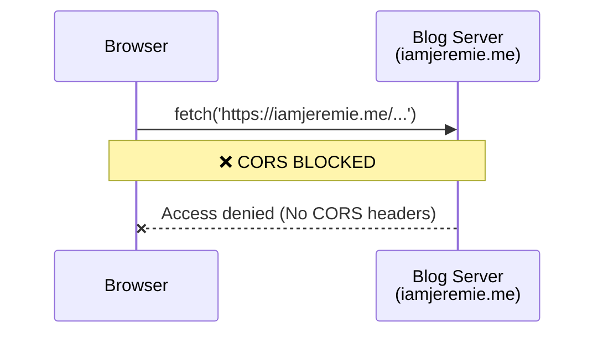
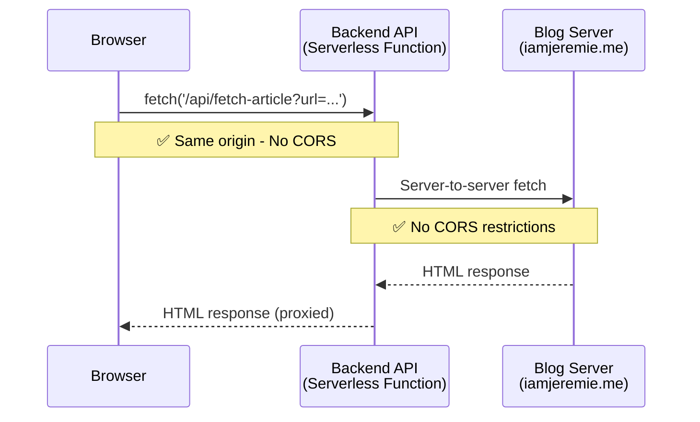
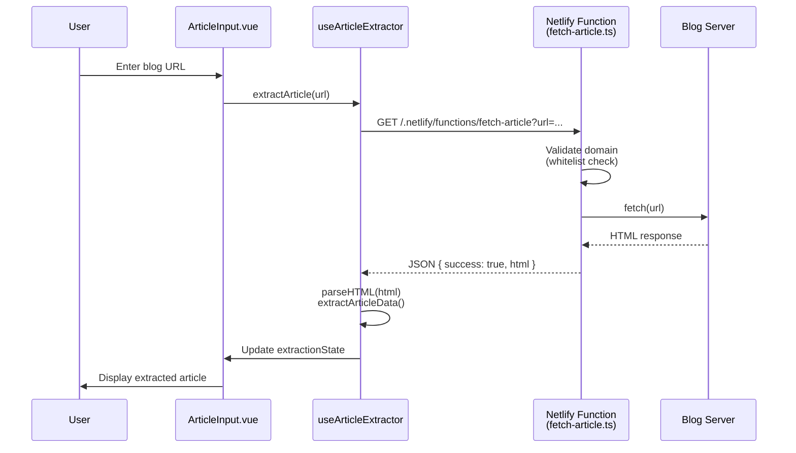

# Task 009: Backend Proxy for CORS-Free HTML Fetching

## Problem Statement

The current SPA cannot fetch HTML from blog URLs due to browser CORS restrictions:
- Browser blocks `fetch()` from `localhost:5173` → `https://iamjeremie.me`
- Blog servers don't have CORS headers allowing cross-origin requests
- Pure client-side fetching is not viable

## Solution: Backend Proxy

Add a backend API that fetches HTML server-side (no CORS between servers) and proxies it to the SPA.

## Architecture Comparison

### Current Architecture (Doesn't Work)



### Proposed Architecture (Works)



## Repository Structure Options

### ✅ Recommended: Netlify Functions (Same Repo)

```
SocialMediaPublisherApp/
├── src/                    # Vue SPA
│   ├── components/
│   ├── composables/
│   └── ...
├── netlify/
│   └── functions/          # Netlify Functions
│       └── fetch-article.ts
├── netlify.toml            # Netlify config (optional)
└── package.json
```

**Pros:**
- ✅ Single repository
- ✅ Single deployment (deploy SPA + Functions together)
- ✅ No server management (serverless auto-scales)
- ✅ Free tier: 125k function requests/month
- ✅ Simple local development with Netlify CLI
- ✅ Automatic TypeScript compilation
- ✅ Same origin (no CORS between SPA and functions)

**Cons:**
- Platform-specific (tied to Netlify)
- Cold starts on free tier (~100-500ms first request)

**Deployment:**
- Netlify automatically detects `/netlify/functions/` folder
- Push to GitHub → Auto-deploys SPA + Functions
- No extra configuration needed

---

### Alternative: Express Backend (Same Repo, Monorepo)

```
SocialMediaPublisherApp/
├── frontend/         # Vue SPA
│   ├── src/
│   └── package.json
├── backend/          # Express API
│   ├── src/
│   │   └── server.ts
│   └── package.json
└── package.json (root)
```

**Pros:**
- Platform-agnostic
- Full control over server
- Can add more complex logic

**Cons:**
- More complex local development (run 2 processes)
- Need to manage/pay for server hosting
- More complex deployment (two apps)

---

### Alternative: Separate Backend Repo

```
SocialMediaPublisherApp/     # Repo 1: Vue SPA
SocialMediaPublisherAPI/     # Repo 2: Express API
```

**Pros:**
- Complete separation of concerns
- Independent deployment cycles

**Cons:**
- Two repositories to maintain
- More complex to coordinate changes
- Need to manage CORS between deployed apps

---

## Recommended Implementation: Netlify Functions

### API Endpoint Specification

**Endpoint:** `GET /.netlify/functions/fetch-article`

**Query Parameters:**
- `url` (required): Full URL to the blog article

**Request Example:**
```typescript
// From your SPA code
const response = await fetch(
  `/.netlify/functions/fetch-article?url=${encodeURIComponent(blogUrl)}`
)
const data = await response.json()
```

**Success Response:**
```json
{
  "success": true,
  "html": "<html>...</html>",
  "url": "https://iamjeremie.me/post/..."
}
```

**Error Response:**
```json
{
  "success": false,
  "error": "Failed to fetch article",
  "details": "404 Not Found"
}
```

### Function URL Pattern

- **Local development**: `http://localhost:8888/.netlify/functions/fetch-article`
- **Production**: `https://yourapp.netlify.app/.netlify/functions/fetch-article`
- **In SPA code**: Use relative URL `/.netlify/functions/fetch-article` (works everywhere)

### User Flow Diagram



### Complete Implementation Example

#### Netlify Function (netlify/functions/fetch-article.ts)

```typescript
import type { Handler, HandlerEvent, HandlerContext } from '@netlify/functions'

const ALLOWED_DOMAINS = ['iamjeremie.me', 'jeremielitzler.fr']

interface FetchArticleResponse {
  success: boolean
  html?: string
  error?: string
}

export const handler: Handler = async (
  event: HandlerEvent,
  context: HandlerContext
) => {
  // Only allow GET requests
  if (event.httpMethod !== 'GET') {
    return {
      statusCode: 405,
      body: JSON.stringify({ success: false, error: 'Method not allowed' }),
    }
  }

  // Get URL from query parameters
  const url = event.queryStringParameters?.url

  if (!url) {
    return {
      statusCode: 400,
      body: JSON.stringify({ success: false, error: 'Missing url parameter' }),
    }
  }

  // Validate URL format
  let urlObj: URL
  try {
    urlObj = new URL(url)
  } catch (error) {
    return {
      statusCode: 400,
      body: JSON.stringify({ success: false, error: 'Invalid URL format' }),
    }
  }

  // Validate domain is whitelisted
  if (!ALLOWED_DOMAINS.includes(urlObj.hostname)) {
    return {
      statusCode: 403,
      body: JSON.stringify({
        success: false,
        error: `Domain not allowed. Allowed domains: ${ALLOWED_DOMAINS.join(', ')}`,
      }),
    }
  }

  // Fetch HTML from blog
  try {
    const response = await fetch(url, {
      headers: {
        'User-Agent': 'SocialMediaPublisherApp/1.0',
      },
    })

    if (!response.ok) {
      return {
        statusCode: response.status,
        body: JSON.stringify({
          success: false,
          error: `Failed to fetch: ${response.status} ${response.statusText}`,
        }),
      }
    }

    const html = await response.text()

    const responseBody: FetchArticleResponse = {
      success: true,
      html,
    }

    return {
      statusCode: 200,
      headers: {
        'Content-Type': 'application/json',
      },
      body: JSON.stringify(responseBody),
    }
  } catch (error) {
    console.error('Error fetching article:', error)
    return {
      statusCode: 500,
      body: JSON.stringify({
        success: false,
        error: 'Internal server error',
      }),
    }
  }
}
```

#### Updated SPA Code (src/composables/useArticleExtractor.ts)

```typescript
/**
 * Fetch HTML content from a URL via Netlify Function proxy
 */
async function fetchHTML(url: string): Promise<string> {
  const functionUrl = `/.netlify/functions/fetch-article?url=${encodeURIComponent(url)}`

  const response = await fetch(functionUrl)

  if (!response.ok) {
    throw new Error(`Failed to fetch article: ${response.status} ${response.statusText}`)
  }

  const data = await response.json()

  if (!data.success) {
    throw new Error(data.error || 'Failed to fetch article')
  }

  return data.html
}
```

### Security Considerations

1. **URL Validation**: Only allow fetching from whitelisted domains
   ```typescript
   const ALLOWED_DOMAINS = ['iamjeremie.me', 'jeremielitzler.fr']
   ```

2. **Rate Limiting**: Netlify has built-in rate limits (125k requests/month free tier)

3. **Error Handling**: Don't expose internal errors to client (generic messages only)

4. **HTTPS Only**: Both blogs use HTTPS, function enforces secure connections

5. **No Authentication Needed**: Public blog posts only

6. **Method Validation**: Only allow GET requests

## Implementation Tasks

### Step 1: Setup Netlify CLI for local development
- [ ] Install Netlify CLI globally: `npm install -g netlify-cli`
- [ ] Test local dev server: `netlify dev`
  - SPA runs on `http://localhost:8888`
  - Functions auto-available at `/.netlify/functions/*`
- [ ] Install Netlify Functions types: `npm install -D @netlify/functions`

### Step 2: Create Netlify Function
- [ ] Create folder structure: `netlify/functions/`
- [ ] Create `netlify/functions/fetch-article.ts`
- [ ] Implement URL validation against whitelist (iamjeremie.me, jeremielitzler.fr)
- [ ] Implement HTML fetching with error handling
- [ ] Add TypeScript types from `@netlify/functions`
- [ ] Return proper JSON response with status codes

**Function Template:**
```typescript
import type { Handler, HandlerEvent } from '@netlify/functions'

const ALLOWED_DOMAINS = ['iamjeremie.me', 'jeremielitzler.fr']

export const handler: Handler = async (event: HandlerEvent) => {
  // Implementation here
}
```

### Step 3: Update SPA to use Netlify Function
- [ ] Modify `src/composables/useArticleExtractor.ts` → `fetchHTML()` function
- [ ] Change from direct fetch to `/.netlify/functions/fetch-article?url=...`
- [ ] Update response parsing (now returns JSON with `{ success, html }`)
- [ ] Update error handling for proxy errors
- [ ] Test with both English and French blog URLs locally

**Updated fetchHTML:**
```typescript
async function fetchHTML(url: string): Promise<string> {
  const response = await fetch(
    `/.netlify/functions/fetch-article?url=${encodeURIComponent(url)}`
  )

  if (!response.ok) {
    throw new Error(`HTTP ${response.status}: ${response.statusText}`)
  }

  const data = await response.json()

  if (!data.success) {
    throw new Error(data.error || 'Failed to fetch article')
  }

  return data.html
}
```

### Step 4: Testing
- [ ] Test locally with `netlify dev`
- [ ] Manual testing with real blog URLs
- [ ] Test error cases:
  - Invalid URL format
  - Disallowed domain
  - 404 from blog server
  - Network timeout
- [ ] Verify all existing tests still pass (mock the new endpoint)
- [ ] Update `useArticleExtractor.test.ts` to mock Netlify function response

### Step 5: Deployment
- [ ] Commit changes to git
- [ ] Push to GitHub
- [ ] Netlify auto-deploys (if connected to repo)
- [ ] Verify function appears in Netlify dashboard: Functions tab
- [ ] Test in production with actual blog URLs
- [ ] Monitor function logs in Netlify dashboard

### Step 6: Configuration (Optional)
- [ ] Create `netlify.toml` if custom config needed:
```toml
[build]
  command = "npm run build"
  publish = "dist"
  functions = "netlify/functions"

[functions]
  node_bundler = "esbuild"
```

### Step 7: Documentation
- [ ] Update README with:
  - Local development: `netlify dev`
  - Netlify Functions setup
  - Function endpoint documentation
- [ ] Add ADR for architecture decision (serverless functions)
- [ ] Document allowed domains whitelist

## Alternative: Quick Test with CORS Proxy Service

For immediate testing without backend implementation:

```typescript
// Temporary solution for testing only
async function fetchHTML(url: string): Promise<string> {
  const proxyUrl = `https://api.allorigins.win/raw?url=${encodeURIComponent(url)}`
  const response = await fetch(proxyUrl)
  return response.text()
}
```

**Note:** Not recommended for production (rate limits, reliability, privacy)

## Decision: Netlify Functions

**Selected approach:** Netlify Functions (Serverless)

**Rationale:**
- Already deploying on Netlify (assumption)
- Single repo, single deployment
- Free tier sufficient for expected usage
- No server management required
- TypeScript support built-in
- Same origin (no CORS between SPA and function)

**Alternatives considered:**
1. **Express backend** - Rejected: Adds complexity, requires separate hosting
2. **CORS proxy service** - Rejected: Not reliable for production, privacy concerns
3. **Vercel Functions** - Alternative if switching platforms

## Acceptance Criteria

- [ ] User can fetch HTML from blog URLs without CORS errors
- [ ] Only whitelisted domains are allowed
- [ ] Error messages are user-friendly
- [ ] All existing tests pass
- [ ] Local development works with `vercel dev` or similar
- [ ] Production deployment works
- [ ] Architecture decision documented in ADR

## Estimated Effort

- Serverless function approach: 2-3 hours
- Express backend approach: 4-6 hours
- Documentation and testing: 1-2 hours

**Total: 3-8 hours depending on approach**
